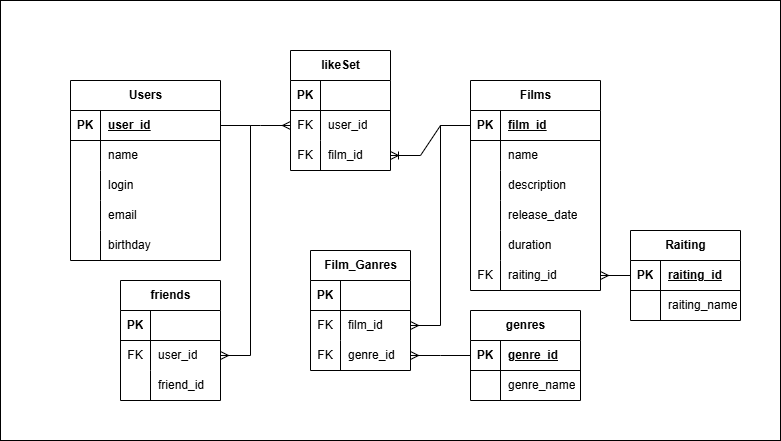

# java-filmorate
Template repository for Filmorate project.

примеры запросов:
- получение топ-10 фильмов по количеству лайков

  SELECT f.name,
      COUNT(l.film_id) AS likes
  FROM films AS f
  INNER JOIN likeSet AS l ON f.film_id = l.film_id
  GROUP BY l.film_id
  ORDER BY likes DESC
  LIMIT 10;

- Получение списка подтверждённых друзей
  (подтверждённой считается дружба в случае когда есть 2 записи о ней в таблице friends)
  SELECT u.*
  FROM Users u
  INNER JOIN friends f ON u.user_id = f.user2_id
  WHERE f.user1_id = X
  AND EXISTS (
  SELECT 1
  FROM friends f2
  WHERE f2.user1_id = f.user2_id
  AND f2.user2_id = f.user1_id
  );

- получение всех фильмов определённого жанра
  SELECT g.genre_name,
         f.name
  FROM genres AS g
  INNER JOIN film_ganres AS fg ON g.genre_id = fg.genre_id
  INNER JOIN films AS f ON fg.film_id = f.film_id
  WHERE g.genre_name = 'X'
  GROUP BY g.genre_name;